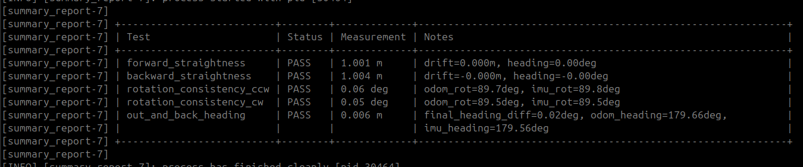
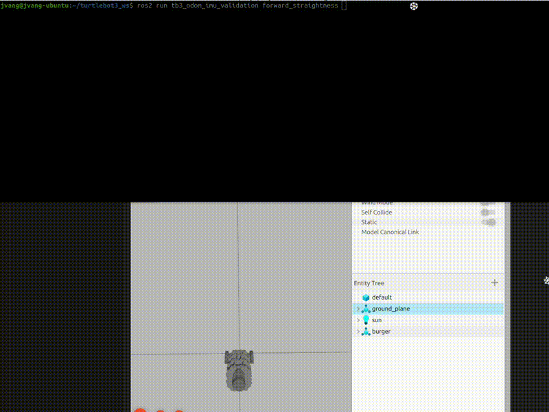
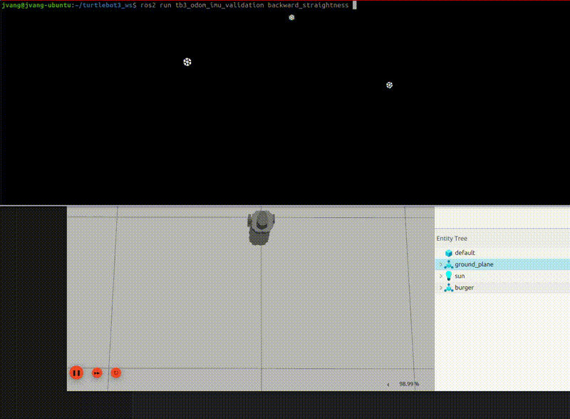
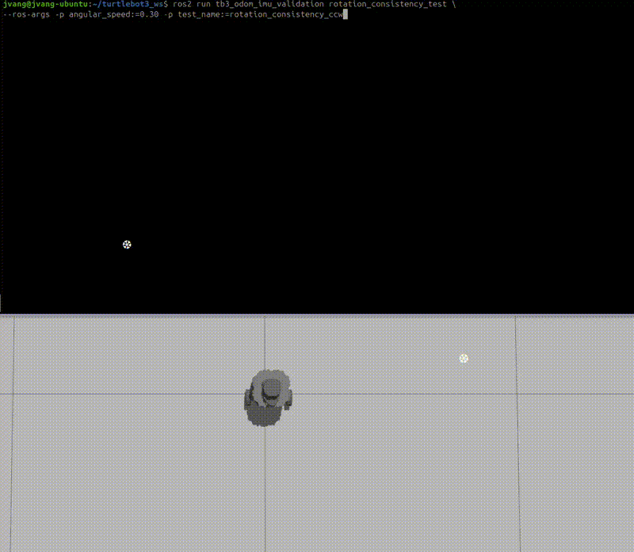
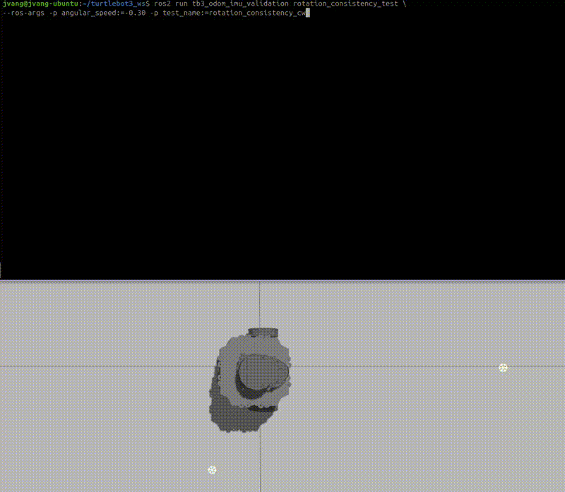
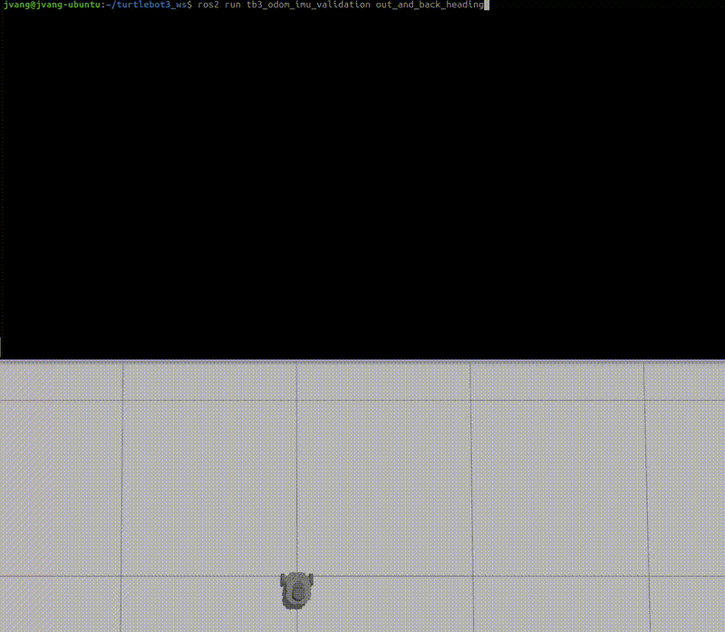

# tb3_odom_imu_validation

A ROS 2 (Jazzy) odometry + IMU validation suite for TurtleBot3 using straight-line motion, rotation consistency, and combined trajectory tests.

This package evaluates how well odometry and IMU agree during motion, including drift, heading consistency, and accumulated error.

---

## Overview

This package contains five validation tests:

| Test | Description |
|-----|-------------|
| `forward_straightness` | Drive forward and measure lateral drift and heading change |
| `backward_straightness` | Drive backward and measure lateral drift and heading change |
| `rotation_consistency_ccw` | Rotate counter-clockwise and compare odom vs IMU yaw |
| `rotation_consistency_cw` | Rotate clockwise and compare odom vs IMU yaw |
| `out_and_back_heading` | Drive forward, rotate 180°, return, and measure closure + heading error |

---

## Demo

### Full Validation Launch

```bash
ros2 launch tb3_odom_imu_validation odom_imu_validation_all.launch.py
```

<p align="center">
  
</p>

---

### Forward Straightness

```bash
ros2 run tb3_odom_imu_validation forward_straightness
```
OR
```bash
ros2 run tb3_odom_imu_validation straightness_test --ros-args -p linear_speed:=0.08 -p test_name:=forward_straightness
```

<p align="center">
  
</p>

---

### Backward Straightness

```bash
ros2 run tb3_odom_imu_validation backward_straightness
```
OR
```bash
ros2 run tb3_odom_imu_validation straightness_test --ros-args -p linear_speed:=-0.08 -p test_name:=backward_straightness
```

<p align="center">
  
</p>

---

### Rotation Consistency CCW

```bash
ros2 run tb3_odom_imu_validation rotation_consistency_test --ros-args -p angular_speed:=0.30 -p test_name:=rotation_consistency_ccw
```

<p align="center">
  
</p>

---

### Rotation Consistency CW

```bash
ros2 run tb3_odom_imu_validation rotation_consistency_test --ros-args -p angular_speed:=-0.30 -p test_name:=rotation_consistency_cw
```

<p align="center">
  
</p>

---

### Out and Back Heading

```bash
ros2 run tb3_odom_imu_validation out_and_back_heading
```

<p align="center">
  
</p>

---

## Topics Used

```
/odom
/imu
/cmd_vel
```

These tests validate the full sensing and motion pipeline:

```
cmd_vel → robot motion → odometry + IMU → pose + yaw estimation
```

---

## Why This Matters

Before relying on sensor fusion (EKF, Nav2, SLAM), you want to verify:

- odometry drift behavior
- IMU heading stability
- agreement between odom and IMU
- straight-line tracking accuracy
- rotation symmetry (CW vs CCW)
- accumulated error over trajectories

This package helps validate your base state estimation before debugging higher-level systems.

---

## Installation

```bash
cd ~/your_ros2_ws/src
git clone https://github.com/johnnyjvang/tb3_odom_imu_validation.git
```

```bash
cd ~/your_ros2_ws
colcon build
source install/setup.bash
```

---

## Running on Real TurtleBot3

Terminal 1:

```bash
source /opt/ros/jazzy/setup.bash
export TURTLEBOT3_MODEL=burger
ros2 launch turtlebot3_bringup robot.launch.py
```

Terminal 2:

```bash
cd ~/your_ros2_ws
source install/setup.bash
```

Run full suite:

```bash
ros2 launch tb3_odom_imu_validation odom_imu_validation_all.launch.py
```

---

## Running in Simulation

Terminal 1:

```bash
source /opt/ros/jazzy/setup.bash
export TURTLEBOT3_MODEL=burger
ros2 launch turtlebot3_gazebo empty_world.launch.py
```

Terminal 2:

```bash
cd ~/your_ros2_ws
source install/setup.bash
```

Run full suite:

```bash
ros2 launch tb3_odom_imu_validation odom_imu_validation_all.launch.py
```

---

## Expected Results

### Straightness Tests

```
Distance: ~1.0 m
Lateral drift: small (< 0.05 m typical)
Heading drift: small (< 5° typical)
```

### Rotation Consistency Tests

```
Odom vs IMU difference: small (< 5° typical)
Rotation close to target (90°)
```

### Out and Back Test

```
Final closure error: small (< 0.1 m typical)
Heading agreement: within tolerance
```

---

## Expected Output

<p align="center">
  
</p>

---

## Package Structure

```text
tb3_odom_imu_validation/
├── launch/
│   └── odom_imu_validation_all.launch.py
├── docs/
│   ├── forward.gif
│   ├── backward.gif
│   ├── ccw.gif
│   ├── cw.gif
│   ├── out_and_back.gif
│   └── json_output.png
├── tb3_odom_imu_validation/
│   ├── straightness_test.py
│   ├── rotation_consistency_test.py
│   ├── out_and_back_heading.py
│   ├── reset_results.py
│   ├── summary_report.py
│   └── result_utils.py
├── package.xml
├── setup.py
├── setup.cfg
└── LICENSE
```

---

## Notes

- Straightness tests use both odom and IMU to detect drift.
- Rotation tests compare odom vs IMU yaw directly.
- Out-and-back test evaluates accumulated system error.
- Simulation results are typically cleaner than real hardware.
- This package is a strong precursor to EKF and localization validation.

---

## License

MIT License
